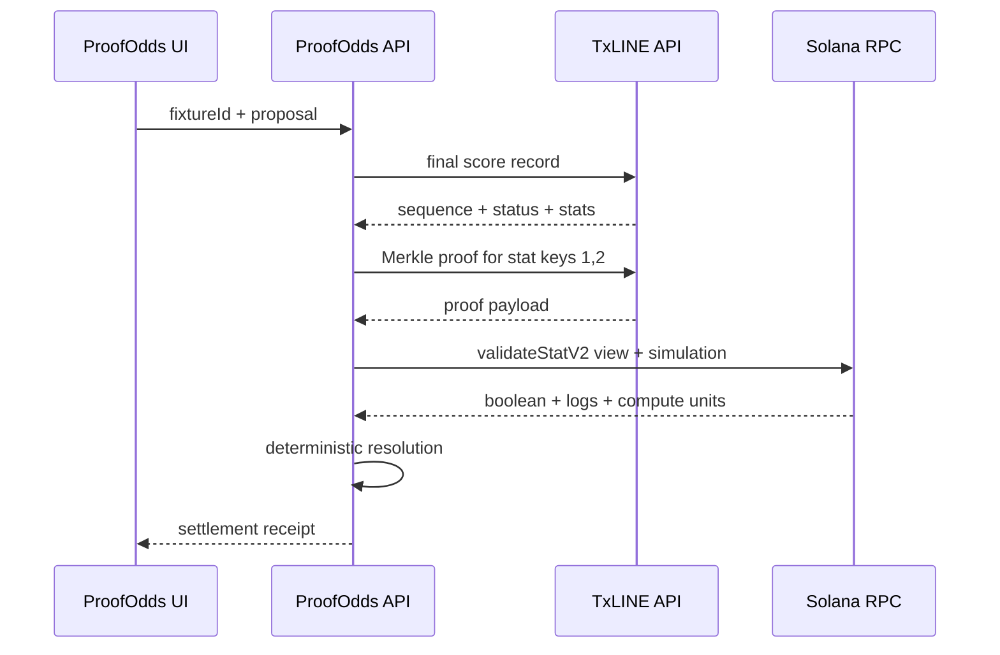

# Architecture

## Resolution contract

ProofOdds accepts a market proposal and only returns `SETTLE` when all conditions are true:

1. The selected score event is final.
2. TxLINE supplies score stat keys `1` and `2` for the same fixture and sequence.
3. TxLINE's `validateStatV2` instruction returns true against the official Solana root PDA.
4. The winner derived from those proven scores equals the proposal.

If the proof passes but the proposal differs, the result is `DISPUTE`. If the event is not final or proof verification fails, the result is `HOLD`.

The rule is implemented as a side-effect-free function in `server/resolution.ts`. The receipt ID hashes the fixture, sequence, proof payload, proposal, decision, and Solana program ID. Wall-clock time is intentionally excluded, so identical evidence produces an identical receipt ID.

## Trust boundaries

- The browser never receives the TxLINE API token.
- The server does not sign or submit a settlement transaction.
- The generated Anchor wallet is used only as a simulation fee payer.
- `passed` is displayed only after the official program returns true and simulation has no error.
- Replay records are labeled `txline-reference` and `SIMULATED REPLAY` throughout the interface and receipt.

## TxLINE normalization

TxLINE examples document both PascalCase and camelCase fields. The normalizer accepts both while emitting one internal schema. Final selection follows the documented World Cup marker: `action=game_finalised`, with `statusId=100` and `period=100` as a compatible fallback.

## Failure behavior

| Failure | Result |
| --- | --- |
| No active match | Replay remains available for evaluation. |
| No score event | Fixture proof may be inspected, but decision is `HOLD`. |
| Non-final score | Decision is `HOLD`. |
| Missing or malformed proof | Solana verifier returns `failed`; decision is `HOLD`. |
| Valid proof, wrong proposal | Decision is `DISPUTE`. |
| Valid proof, matching proposal | Decision is `SETTLE`. |
| Missing TxLINE credential | The application visibly enters reference mode; it does not claim live verification. |

## Production extension

The current build stops at a signed-by-content receipt. A production market adapter would consume only `state=verified` receipts, enforce a settlement delay, and submit the final market transaction from a separately governed executor. This keeps oracle verification independent from fund custody and execution policy.
