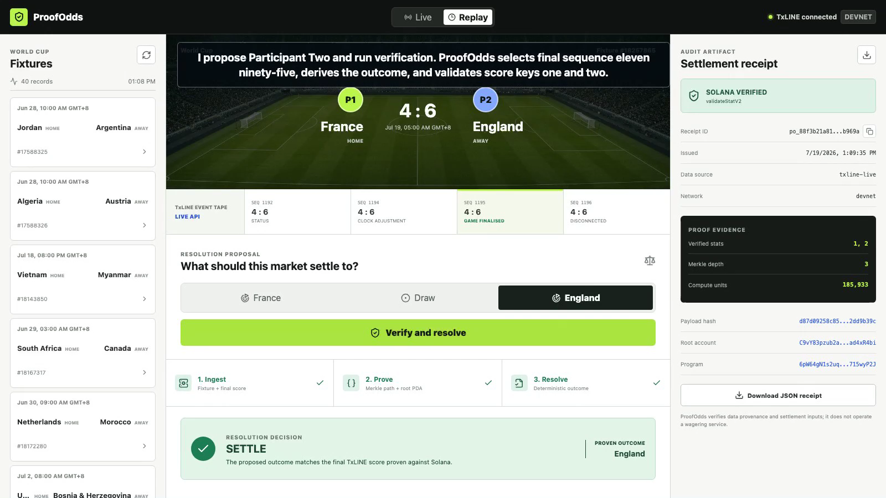
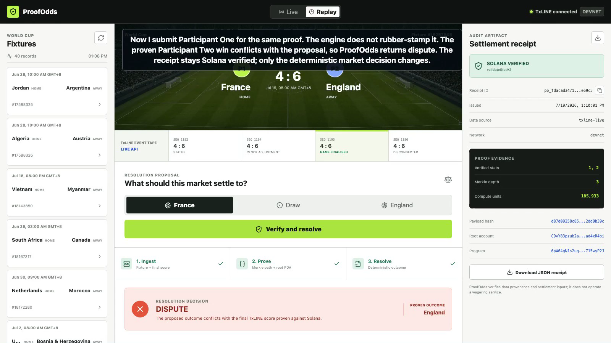
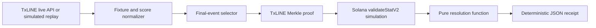

# ProofOdds

ProofOdds is a verifiable resolution workbench for soccer prediction markets. It ingests TxLINE fixtures and score events, proves the selected final score against TxLINE's Solana program, and deterministically returns `SETTLE`, `DISPUTE`, or `HOLD` with a portable JSON receipt.

Live MVP: https://proofodds.vercel.app



## Why it exists

A prediction market is only as trustworthy as its resolution path. Screenshots, manually entered scores, and opaque admin decisions are easy to dispute. ProofOdds turns the resolution itself into an inspectable artifact:

1. Ingest a TxLINE fixture and its score event tape.
2. Select the final `game_finalised` record (`statusId=100`, `period=100`).
3. Request the TxLINE Merkle proof for score stat keys `1` and `2`.
4. Simulate `validateStatV2` against the official TxLINE Solana program and root PDA.
5. Compare the proven winner with the market proposal using a pure deterministic function.
6. Export a content-addressed settlement receipt for operators, auditors, and users.

ProofOdds does not custody funds or operate a wagering service. It is resolution and audit infrastructure.

## Judging criteria

| Criterion | What judges can verify |
| --- | --- |
| Core functionality | Production deployment is connected to TxLINE devnet. Historical fixture `18257865` resolves from final sequence `1195` through a real `validateStatV2` simulation and deterministic receipt export. |
| User experience | One screen covers fixture selection, match state, proposed outcome, proof progress, decision, and technical evidence. Replay mode keeps the full flow demonstrable after matches end. |
| Code quality and logic | Resolution is a pure function in `server/resolution.ts`; receipt IDs are deterministic; API normalization accepts documented PascalCase and camelCase payloads; tests cover settle, dispute, hold, canonical hashing, and receipt stability. |
| Demo readiness | Replay mode defaults to a completed TxLINE fixture, so the video can show both `SETTLE` and `DISPUTE` from the same cryptographically verified evidence after live activity ends. |



## Live and replay modes

- **Live** uses `/fixtures/snapshot`, `/scores/snapshot/{fixtureId}`, `/scores/stat-validation`, and Solana devnet verification. The production deployment is configured for this path.
- **Replay with TxLINE connected** requests a historical fixture window from the same live API and verifies the returned proof on Solana. It is the default judging path.
- **Reference fallback** uses a clearly labeled, simulated TxLINE-shaped event sequence only when credentials or upstream APIs are unavailable. It never presents simulated evidence as live or cryptographically verified.
- Both modes use the same selection and resolution interface. This prevents a dead demo when no match is active during judging.

## Architecture



See [ARCHITECTURE.md](ARCHITECTURE.md) for trust boundaries and failure behavior.

## Run locally

Requirements: Node.js 20, 22, or 24 and npm.

```bash
npm install
cp .env.example .env.local
npm run dev:full
```

Without a TxLINE token the app starts in labeled replay mode. To activate the official devnet free tier with an isolated wallet:

```bash
npm run activate:txline
```

The script stores the wallet outside the repository and writes the API token to ignored `.env.local`. It never prints or commits either secret. If Node must use an HTTP proxy, prefix the command with `NODE_USE_ENV_PROXY=1`.

## Quality gates

```bash
npm run check
```

The suite verifies canonical hashing, settle/dispute/hold logic, stable receipt IDs, and the primary user interface.

Run the deployed end-to-end smoke:

```bash
npm run smoke:online
```

The smoke discovers a completed fixture, derives the matching proposal from its final score, and asserts `txline-live`, `validateStatV2`, `simulationStatus=passed`, and `decision=settle`.

## API

- `GET /api/health` reports network and data source.
- `GET /api/txline?action=fixtures` returns normalized fixtures.
- `GET /api/txline?action=events&fixtureId=...` returns the score event tape.
- `GET /api/txline?action=verify&fixtureId=...&proposal=draw` returns a settlement receipt.

## Official integration

- TxLINE World Cup documentation: https://txline.txodds.com/documentation/worldcup
- TxLINE on-chain examples: https://github.com/txodds/tx-on-chain
- Devnet program: `6pW64gN1s2uqjHkn1unFeEjAwJkPGHoppGvS715wyP2J`

Third-party attribution is documented in [THIRD_PARTY.md](THIRD_PARTY.md).
